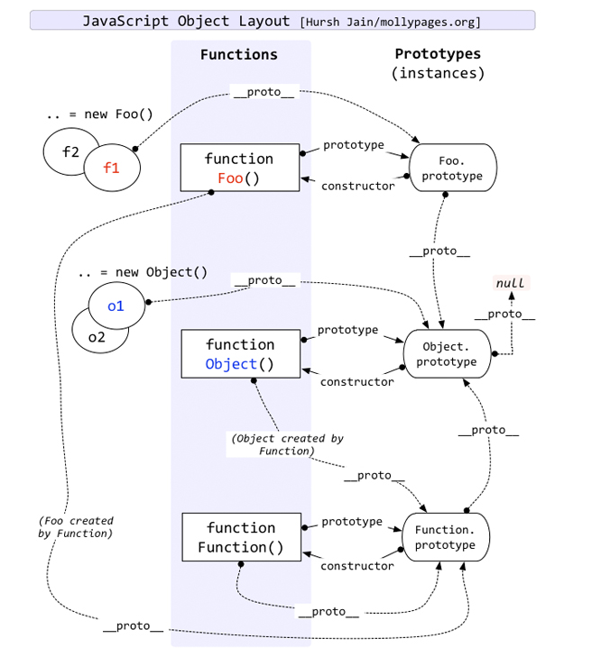

# 原型链相关知识


> ES6之前是没有`class`关键字的, 是通过函数实现的

```javascript
function Foo() {

}

var foo = new Foo();
```

## 函数本身就是构造函数

```javascript
function Foo(age) {
  this.age = age;
}

var foo = new Foo(1);
console.log(foo.age); // 1
```

## 添加实例方法

```javascript
Foo.prototype.say = function () {
  console.log("FooFooFoo");
}
```

## \_\_proto\_\_

> 发现`say`方法没有在`foo`对象上找到, 但是却能通过`foo.__proto__`找到, 从而发现它指向`Foo.prototype`

```javascript
foo.__proto__ === Foo.prototype
foo.__proto__.__proto__ === Object.prototype
foo.__proto__.__proto__.__proto__ === null

// 这一层层的指向关系就是原型链
```

## 静态方法

> 参考`jQuery`实现

## 继承

> 通过上述了解到, 所谓继承就是子类能够访问父类的属性和方法, 即子类能够指向父类的`prototype`, 也就是子类原型的`__proto__`指向父类原型

```javascript
function Parent() {
}

function Child() {
}

// Child.prototype.__proto__ = new Parent(); // 多了__proto__层级

Child.prototype = new Parent();
Child.prototype.constructor = Child;      // 注意重置constructor

const obj = new Child();
console.log(obj instanceof Child);   // true
console.log(obj instanceof Parent);   // true
```

## 实现一个`new`运算符

### 语法

```javascript
new constructor[([arguments])]
```

### 描述

- 创建一个空的简单 JavaScript 对象(即`{}`),
- 为步骤 1 新创建的对象添加属性`__proto__`, 将该属性链接至构造函数的原型对象
- 将步骤 1 新创建的对象作为this的上下文
- 如果该函数没有返回对象, 则返回this

### 实现

```javascript
function newNew(func, ...args) {
  const obj = {};     // 新建一个空对象
  obj.__proto__ = func.prototype;    // 设置原型链
  const result = func.call(obj, ...args);  // 执行构造函数

  // 注意如果原构造函数有Object类型的返回值，包括Functoin, Array, Date, RegExg, Error
  // 那么应该返回这个返回值
  const isObject = typeof result === 'object' && result !== null;
  const isFunction = typeof result === 'function';
  if (isObject || isFunction) {
    return result;
  }

  // 原构造函数没有Object类型的返回值，返回我们的新对象
  return obj;
}

function Foo(age) {
  this.age = age;
}

Foo.prototype.say = function () {
  console.log("FooFooFoo");
}

const foo = newNew(Foo, 2);

console.log(foo.age);  // 2
console.log(foo.say());     // FooFooFoo
```

## 实现一个`instanceof`运算符

> `instanceof`运算符用于检测构造函数的`prototype`属性是否出现在某个实例对象的原型链上

### 语法

```javascript
object instanceof constructor
```

### 描述

> `instanceof`运算符用来检测`constructor.prototype`是否存在于参数`object`的原型链上

### 实现

```javascript
function newInstanceof(targetObj, targetClass) {
  // 参数检查
  if (!targetObj || !targetClass || !targetObj.__proto__ || !targetClass.prototype) {
    return false;
  }

  let current = targetObj;

  while (current) {   // 一直往原型链上面找
    if (current.__proto__ === targetClass.prototype) {
      return true;    // 找到了返回true
    }

    current = current.__proto__;
  }

  return false;     // 没找到返回false
}

// 用我们前面的继承实验下
function Parent() {
}

function Child() {
}

Child.prototype.__proto__ = Parent.prototype;

const obj = new Child();
console.log(newInstanceof(obj, Child));   // true
console.log(newInstanceof(obj, Parent));   // true
console.log(newInstanceof({}, Parent));   // false
```

## ES6的`class`

```javascript
class Foo {
  // 构造函数
  constructor(age) {
    this.age = age;
  }

  // 实例方法
  say() {
    console.log("FooFooFoo")
  }

  // 静态方法
  static statciFunc() {
    console.log('我是静态方法，this拿不到实例对象');
  }
}

const foo = new Foo(2);
console.log(foo.age);    // 2
console.log(foo.say());       // 汪汪汪
console.log(Foo.statciFunc());  // 我是静态方法，this拿不到实例对象
```

## 资料

- [new 运算符](https://developer.mozilla.org/zh-CN/docs/Web/JavaScript/Reference/Operators/new)
- [对象原型](https://developer.mozilla.org/zh-CN/docs/Learn/JavaScript/Objects/Object_prototypes)
