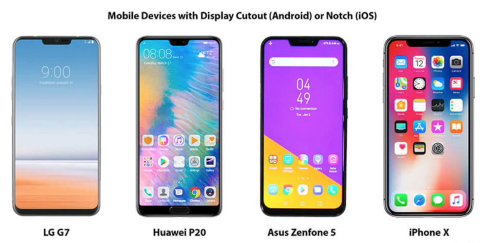
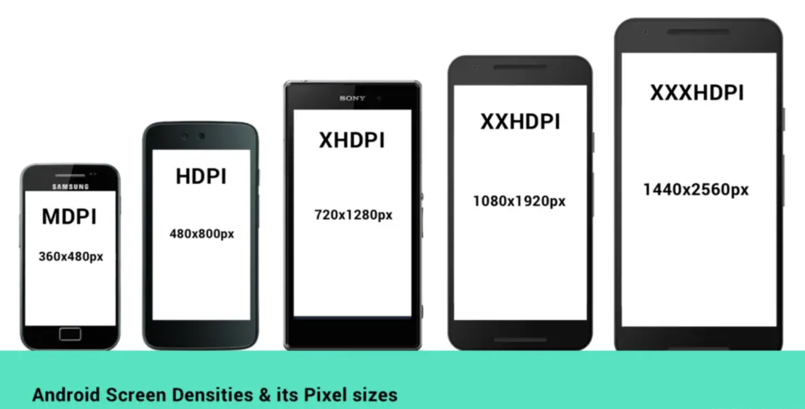
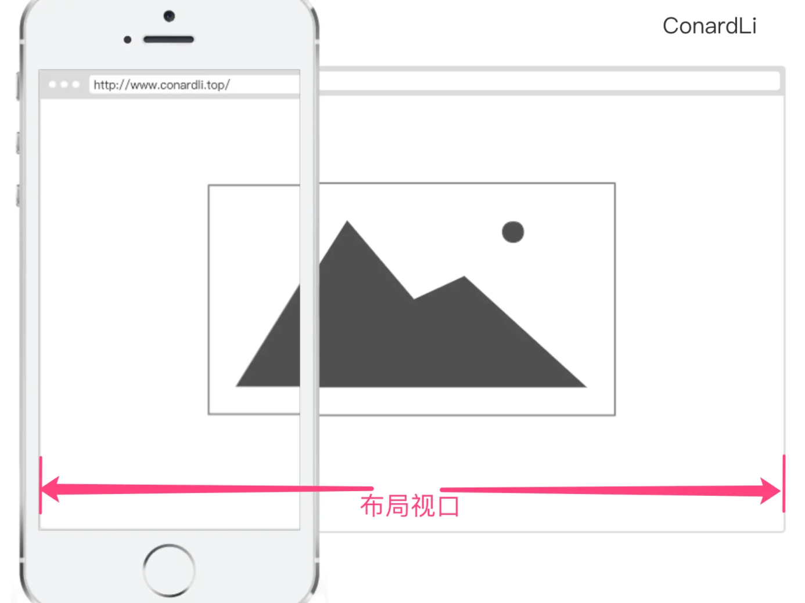
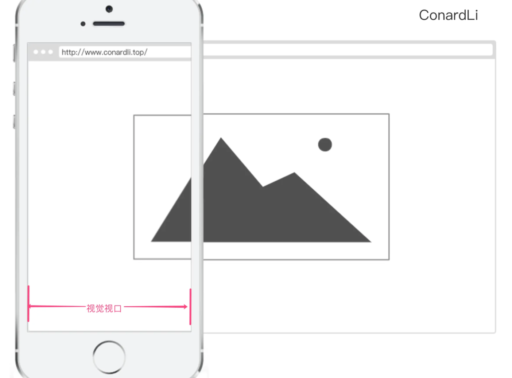
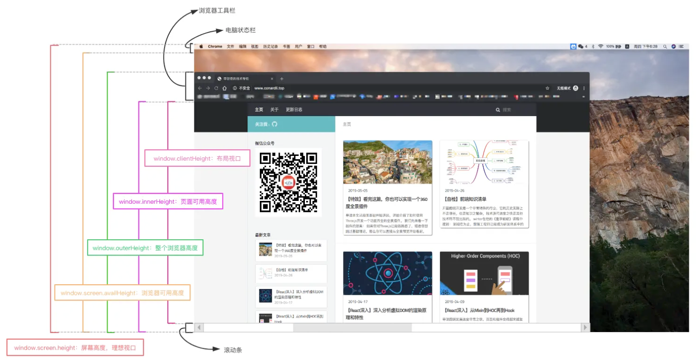

# 移动端适配解决方案汇总

> Mobile Terminal Adaptation Solution Summary



## 前言

### 自适应与响应式的区别

```
响应式设计表示在不同的屏幕尺寸下，都有良好的布局和内容表现，简单一点的说，就是一个页面可以适配多种不同尺寸的屏幕，而且看上去还是设计良好的。
为了实现这个目的，可能会利用 js 或者 css 去动态改变布局的尺寸，在这个过程中会伴随元素尺寸的改变，布局的改变，甚至会把元素隐藏。

而自适应往往考虑的是另一个方面，就是希望页面的设计与设计稿的设计比例一致，这个也是做自适应的目的，在这个过程中针对不同的屏幕宽度元素的尺寸也会改变，但是一般不会有布局改变，和元素的隐藏，那些按照 css 媒体查询写的自适应严格来说不叫自适应，因为断点之间会造成比例误差。
```

## 相关概念

### 1. 英寸

> 这个尺寸指的是屏幕对角线的长度 <code>1英寸 = 2.54厘米</code>

### 2. 分辨率

#### 2.1 像素

- 像素可以作为图片或电子屏幕的最小组成单位

#### 2.2 屏幕分辨率

- 屏幕分辨率指一个屏幕具体由多少个像素点组成

#### 2.3 图像分辨率

- 通常说的图片分辨率其实是指图片含有的像素数，比如一张图片的分辨率为<code>800x400</code>。这表示图片分别在垂直和水平上所具有的像素点数为<code>800</code>和<code>400</code>
- 同一尺寸的图片，分辨率越高，图片越清晰

#### 2.4 PPI

- 每英寸包括的像素数
- <code>根号</code><code>[水平像素点数^2+垂直像素点数^2]</code>除以<code>尺寸</code> 数学公式: [? \frac{\sqrt{水平像素点数^2+垂直像素点数^2}}{尺寸}?]

#### 2..5 DPI

- 每英寸包括的点数

---
```---```
<font color=red>以上描述的像素都是物理像素，即设备上真实的物理单元</font>
```---```
---

### 3. 设备独立像素

#### 3.1 设备像素比

- 设备像素比<code>device pixel ratio</code>简称<code>dpr</code>，即物理像素和设备独立像素的比值
    1. iOS

       |型号|屏幕尺寸(inch)|屏幕密度(ppi)|屏幕宽高(pt)|屏幕分辨率(px)|倍图|屏幕比例|
                                                                                                                                                                                                                                                                                                                                                                                                                                                                                                                                                                                                                                                                                                     |----|----|----|----|----|----|----|
       |4/4s|3.5|326|320*480|640*960|@2x|3:2|
       |5/5c/5s/se(第一代)|4.0|326|320*568|640*1136|@2x|16:9|
       |6/6s/7/8/se(第二代)|4.7|326|375*667|750*1334|@2x|16:9|
       |6+/6s+/7+/8+|5.5|326|414*736|1242*2208|@3x|16:9|
       |X/XS/11Pro|5.8|458|375*812|1125*2436|@3x|19.5:9|
       |XR/11|6.1|326|414*896|828*1792|@2x|19.5:9|
       |XS MAX/11Pro MAX|6.5|458|414*896|1242*2688|@3x|19.5:9|
       |iPhone12 min|5.4|476|375*812|1080*2340|@3x|19.5:9|
       |iPhone12/12Pro|6.1|460|390*844|1170*2532|@3x|19.5:9|
       |iPhone12Pro Max|6.7|458|428*926|1284*2778|@3x|19.5:9|
       |iPhone13 min|5.4|476|360*780|1080*2340|@3x|19.5:9|
       |iPhone13/13Pro|6.1|460|390*844|1170*2532|@3x|19.5:9|
       |iPhone13Pro Max|6.7|458|428*926|1284*2778|@3x|19.5:9|

    2. Android
       

#### 3.2 移动端开发

|开发技术|单位|
|----|----|
|iOS|pt|
|Android|dp|
|React Native|-|

---
```---```
<font color=red>在<code>iOS</code>、<code>Android</code>和<code>React Native</code>开发中样式单位其实都使用的是设备独立像素</font>
```---```
---

#### 3.3 WEB端开发

- 当页面缩放比例为100%时，一个<code>CSS像素</code>等于一个<code>设备独立像素</code>
- 缩放系数 = 理想视口宽度 / 视觉视口宽度

### 4. 视口

- 在Web浏览器术语中，通常与浏览器窗口相同，但不包括浏览器的UI，菜单栏等——即指你正在浏览的文档的那一部分

#### 4.1 布局视口



- 布局视口是网页布局的基准窗口，在PC浏览器上，布局视口就等于当前浏览器的窗口大小（不包括borders 、margins、滚动条）
- 在移动端，布局视口被赋予一个默认值，大部分为<code>980px</code>，可调用<code>document.documentElement.clientWidth / clientHeight</code>获取

#### 4.2 视觉视口



- 用户通过屏幕真实看到的区域
- 视觉视口默认等于当前浏览器的窗口大小（包括滚动条宽度）
- 当用户对浏览器进行缩放时，不会改变布局视口的大小，所以页面布局是不变的，但是缩放会改变视觉视口的大小
- 通过调用<code>window.innerWidth / innerHeight</code>获取

#### 4.3 理想视口

- 布局视口在移动端展示的效果并不是一个理想的效果，所以理想视口(<code>ideal viewport</code>)就诞生了：网站页面在移动端展示的理想大小
- 调用<code>screen.width / height</code>获取

#### 4.4 Meta viewport

```html

<meta name="viewport"
      content="width=device-width; initial-scale=1; maximum-scale=1; minimum-scale=1; user-scalable=no;">
```

|Value|可能值|描述|
|----|----|----|
|width|正整数或device-width|以pixels（像素）为单位， 定义布局视口的宽度|
|height|正整数或device-height|以pixels（像素）为单位， 定义布局视口的高度|
|initial-scale|0.0 - 10.0|定义页面初始缩放比率|
|minimum-scale|0.0 - 10.0|定义缩放的最小值；必须小于或等于maximum-scale的值|
|maximum-scale|0.0 - 10.0|定义缩放的最大值；必须大于或等于minimum-scale的值|
|user-scalable|一个布尔值（yes或者no）|如果设置为 no，用户将不能放大或缩小网页，默认值为 yes|

#### 4.5 移动端适配

- <code>initial-scale = 理想视口宽度 / 视觉视口宽度</code>，设置<code>initial-scale=1</code>;就相当于让视觉视口等于理想视口，这时，1个CSS像素就等于1个设备独立像素

#### 4.6 缩放

- <code>视觉视口宽度 = 理想视口宽度 / initial-scale</code>

#### 4.7 获取浏览器大小



### 5. 1px问题

#### 5.1 border-image

```css
.border_1px {
    border-bottom: 1px solid #000;
}

@media only screen and (-webkit-min-device-pixel-ratio: 2) {
    .border_1px {
        border-bottom: none;
        border-width: 0 0 1px 0;
        border-image: url(../img/1pxline.png) 0 0 2 0 stretch;
    }
}
```

#### 5.2 background-image

```css
.border_1px {
    border-bottom: 1px solid #000;
}

@media only screen and (-webkit-min-device-pixel-ratio: 2) {
    .border_1px {
        background: url(../img/1pxline.png) repeat-x left bottom;
        background-size: 100% 1px;
    }
}
```

#### 5.2 伪元素 + transform

```css
.border_1px:before {
    content: '';
    position: absolute;
    top: 0;
    height: 1px;
    width: 100%;
    background-color: #000;
    transform-origin: 50% 0;
}

@media only screen and (-webkit-min-device-pixel-ratio: 2) {
    .border_1px:before {
        transform: scaleY(0.5);
    }
}

@media only screen and (-webkit-min-device-pixel-ratio: 3) {
    .border_1px:before {
        transform: scaleY(0.33);
    }
}
```

#### 5.4 svg

- 借助PostCSS的postcss-write-svg我们能直接使用border-image和background-image创建svg的1px边框

```css

/*@svg border_1px { */
/*  height: 2px; */
/*  @rect { */
/*    fill: var(--color, black); */
/*    width: 100%; */
/*    height: 50%; */
/*    } */
/*  } */
/*.example { border: 1px solid transparent; border-image: svg(border_1px param(--color #00b1ff)) 2 2 stretch; }*/

```

#### 5.5 设置viewport

### 6. 移动端适配方案

#### 6.1 flexible方案

- ~~可以废弃~~

```js
// set 1rem = viewWidth / 10
function setRemUnit() {
  var rem = document.documentElement.clientWidth / 10
  document.documentElement.style.fontSize = rem + 'px'
}

setRemUnit();
```

#### 6.2 vh、vw方案（没有过高要求时此方案最简便）

- 主要使用插件<code>postcss-px-to-viewport</code>

#### 6.3 px方案（腾讯新闻，知乎，点评，头条）

```css
    @media screen and (max-width: 480px) {
    body {
        background: red;
    }
}

/*宽度小于480px时 绿色*/
@media screen and (min-width: 980px) {
    body {
        background: yellow;
    }
}

/*宽度大于980px时 红色*/

```

#### 6.4 viewport（不缩放）+rem方案（马蜂窝，小米，小红书）

```html

<meta name="viewport" id="vp"
      content="viewport-fit=cover,initial-scale=1,minimum-scale=1,maximum-scale=1,width=device-width,user-scalable=no" />

```

```css

html {
    font-size: 100px
}

.container {
    width: 3.5rem;
    height: 5rem
}
```

#### 6.5 vw+rem方案（京东，网易，饿了么）

```html

<meta name="viewport" id="vp"
      content="viewport-fit=cover,initial-scale=1,minimum-scale=1,maximum-scale=1,width=device-width,user-scalable=no" />
```

```css
html {
    font-size: 100px;
    font-size: 26.66666667vw;
}

@media screen and (min-width: 375px) {
    html {
        font-size: 100px;
        font-size: 26.66666667vw
    }
}

@media screen and (max-width: 320px) {
    html {
        font-size: 90px;
        font-size: 26.66666667vw
    }
}

.container {
    width: 3.5rem;
    height: 5rem
}

```

- 主要使用插件<code>postcss-px-to-viewport</code>

### 7. 适配iPhoneX

#### 7.1 安全区域

#### 7.2 viewport-fit

- cover: 网页内容完全覆盖可视窗口

#### 7.3 env、constant

- <code>constant</code>在iOS < 11.2的版本中生效，<code>env</code>在iOS >= 11.2的版本中生效
    - safe-area-inset-left：安全区域距离左边边界距离
    - safe-area-inset-right：安全区域距离右边边界距离
    - safe-area-inset-top：安全区域距离顶部边界距离
    - safe-area-inset-bottom：安全区域距离底部边界距离

### 8. 横屏适配

#### 8.1 JavaScript检测横屏

```js
window.addEventListener("resize", () => {
  if (window.orientation === 180 || window.orientation === 0) {
    // 正常方向或屏幕旋转180度
    console.log('竖屏');
  }
  ;
  if (window.orientation === 90 || window.orientation === -90) {
    // 屏幕顺时钟旋转90度或屏幕逆时针旋转90度
    console.log('横屏');
  }
});
```

#### 8.2 CSS检测横屏

```css
@media screen and (orientation: portrait) {
    /*竖屏...*/
}

@media screen and (orientation: landscape) {
    /*横屏...*/
}
```

### 9. 专有钉钉应用总结

- 因为此次项目是在钉钉中开发H5微应用，所有会有一些特殊用法

#### 9.1 导航栏 iOS 和 Android 是有差异

- 建议使用自己按 UI 设计实现

#### 9.2 状态栏高度差异兼容

- 调用<code>getPhoneInfo</code>方法返回的<code>statusBarHeight</code>值来设置 css 变量

```js
document.documentElement.style.setProperty('--status-bar-height', statusBarHeight);
```
#### 9.3 overflow 和 height 谨慎处理
#### 9.4 遇到 iOS 真机显示问题调试
- 可以在 mac 上打开 Safari，修改 User Agent 为 iPhone 并且打开调试窗口挤压页面大小来实现手机屏幕大小来复现真机上的问题
## 网上资料

>

1. [关于移动端适配，你必须要知道的](https://juejin.cn/post/6844903845617729549)
2. [移动端 H5 页面适配方案](https://liyucang-git.github.io/2018/04/09/%E7%A7%BB%E5%8A%A8%E7%AB%AFH5%E9%A1%B5%E9%9D%A2%E9%80%82%E9%85%8D%E6%96%B9%E6%A1%88/)
3. [移动端H5网页开发常见问题汇总](https://juejin.cn/post/7055599228478816270)
4. [大厂实战出发，总结H5容器适配方案，不看你就亏了](https://juejin.cn/post/6844904185406701576)
4. [2022 年移动端适配方案指南 — 全网最新最全](https://juejin.cn/post/7046169975706353701)
5. [屏幕尺寸大全](https://uiiiuiii.com/screen/index.htm)
