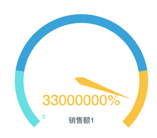
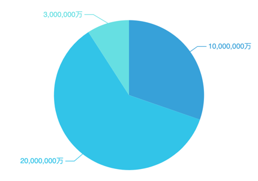
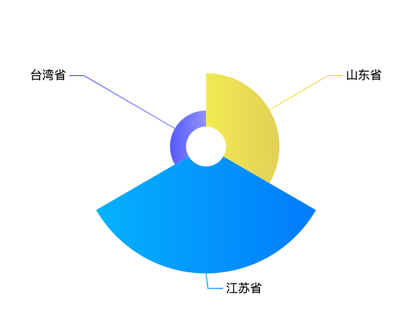
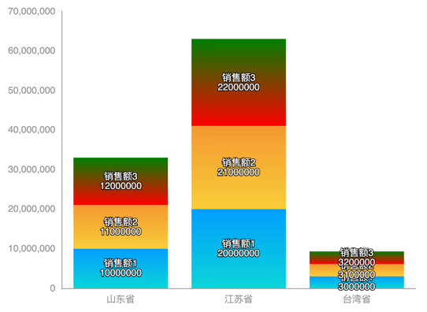
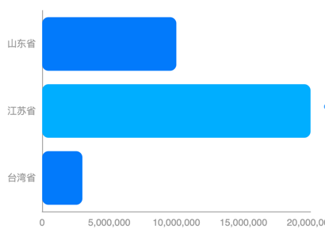
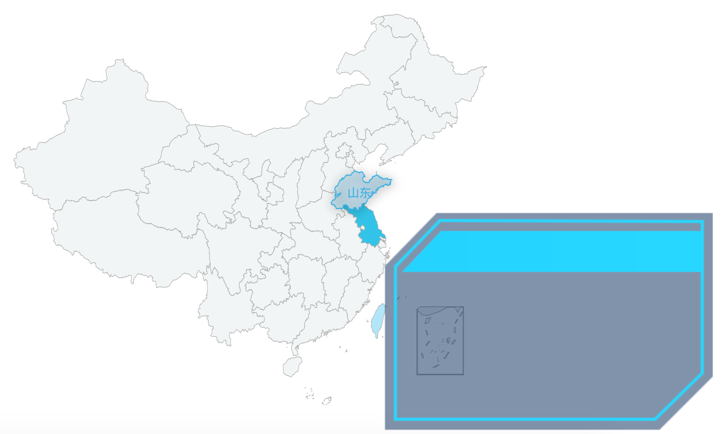

# Smartbi 中 Echarts 的使用心得记录

[Smartbi 官方技术文档](https://history.wiki.smartbi.com.cn/pages/viewpage.action?pageId=44501951)

## 例子展示

> 每个例子不一定是唯一解法, 只是恰好用到而已, 可随意发挥

### 饼图类

> 颜色: 渐变, 其他效果等

1. 占比图
   

```json
{
  "series": [
    {
      "data": [
        {
          "label": {
            "show": false,
            "position": "center"
          },
          "labelLine": {
            "show": false
          },
          "itemStyle": {
            "color": "#0A76BA"
          }
        },
        {
          "label": {
            "show": true,
            "position": "center",
            "color": "#ffffff",
            "fontSize": 36,
            "formatter": "{d}%"
          },
          "itemStyle": {
            "color": {
              "x": 0,
              "y": 0,
              "x2": 1,
              "y2": 0,
              "type": "linear",
              "global": false,
              "colorStops": [
                {
                  "offset": 0,
                  "color": "#FD42B9"
                },
                {
                  "offset": 1,
                  "color": "#F91F83"
                }
              ]
            }
          }
        }
      ]
    }
  ],
  "tooltip": {
    "show": false
  }
}
```

2. 油量图
   

> roundCap: 两端显示成圆形

```json
{
  "series": [
    {
      "axisLine": {
        "roundCap": true,
        "lineStyle": {
          "width": 18
        }
      },
      "detail": {
        "formatter": "{value}%"
      }
    }
  ]
}
```

3. 饼图
   

> 处理千分位并且拼接单位

```json
{
  "label": {
    "show": true,
    "formatter": "function (params) {\n\t\t    return ( params.value + '').replace(/(\\d{1,3})(?=(\\d{3})+(?:$|\\.))/g,'$1,') + '万';\n\t\t}"
  }
}
```

4. 南丁格尔图
   

> 颜色渐变

```json
{
  "series": [
    {
      "data": [
        {
          "itemStyle": {
            "color": {
              "x": 0,
              "y": 0,
              "x2": 1,
              "y2": 0,
              "type": "linear",
              "global": false,
              "colorStops": [
                {
                  "offset": 0,
                  "color": "#f3ea51"
                },
                {
                  "offset": 1,
                  "color": "#e2d058"
                }
              ]
            }
          }
        },
        {
          "itemStyle": {
            "color": {
              "x": 0,
              "y": 0,
              "x2": 1,
              "y2": 0,
              "type": "linear",
              "global": false,
              "colorStops": [
                {
                  "offset": 0,
                  "color": "#05b2fd"
                },
                {
                  "offset": 1,
                  "color": "#027afb"
                }
              ]
            }
          }
        },
        {
          "itemStyle": {
            "color": {
              "x": 0,
              "y": 0,
              "x2": 1,
              "y2": 0,
              "type": "linear",
              "global": false,
              "colorStops": [
                {
                  "offset": 0,
                  "color": "#565afb"
                },
                {
                  "offset": 1,
                  "color": "#8f93fd"
                }
              ]
            }
          }
        }
      ]
    }
  ]
}
```

### 柱状图类

1. 堆积图
   

> 显示标签处理, 堆积图每个柱子颜色渐变

```json
{
  "label": {
    "show": true,
    "formatter": "{a}\n{@[1]}"
  },
  "series": [
    {
      "itemStyle": {
        "color": {
          "x": 0,
          "y": 0,
          "x2": 0,
          "y2": 1,
          "type": "linear",
          "global": false,
          "colorStops": [
            {
              "offset": 0,
              "color": "#029EFD"
            },
            {
              "offset": 1,
              "color": "#0BD5D7"
            }
          ]
        }
      }
    },
    {
      "itemStyle": {
        "color": {
          "x": 0,
          "y": 0,
          "x2": 0,
          "y2": 1,
          "type": "linear",
          "global": false,
          "colorStops": [
            {
              "offset": 0,
              "color": "#F49931"
            },
            {
              "offset": 1,
              "color": "#F8CD39"
            }
          ]
        }
      }
    },
    {
      "itemStyle": {
        "color": {
          "x": 0,
          "y": 0,
          "x2": 0,
          "y2": 1,
          "type": "linear",
          "global": false,
          "colorStops": [
            {
              "offset": 0,
              "color": "green"
            },
            {
              "offset": 1,
              "color": "red"
            }
          ]
        }
      }
    }
  ]
}
```

2. 横条图
   

> 每个柱子间隔变色, 加入足量的 data 数据来支撑每个柱子的颜色需要

```json
{
  "series": [
    {
      "data": [
        {
          "itemStyle": {
            "normal": {
              "color": "#027AFB"
            }
          }
        },
        {
          "itemStyle": {
            "normal": {
              "color": "#00AEFF"
            }
          }
        },
        {
          "itemStyle": {
            "normal": {
              "color": "#027AFB"
            }
          }
        },
        {
          "itemStyle": {
            "normal": {
              "color": "#00AEFF"
            }
          }
        },
        {
          "itemStyle": {
            "normal": {
              "color": "#027AFB"
            }
          }
        },
        {
          "itemStyle": {
            "normal": {
              "color": "#00AEFF"
            }
          }
        },
        {
          "itemStyle": {
            "normal": {
              "color": "#027AFB"
            }
          }
        },
        {
          "itemStyle": {
            "normal": {
              "color": "#00AEFF"
            }
          }
        },
        {
          "itemStyle": {
            "normal": {
              "color": "#027AFB"
            }
          }
        },
        {
          "itemStyle": {
            "normal": {
              "color": "#00AEFF"
            }
          }
        },
        {
          "itemStyle": {
            "normal": {
              "color": "#027AFB"
            }
          }
        },
        {
          "itemStyle": {
            "normal": {
              "color": "#00AEFF"
            }
          }
        },
        {
          "itemStyle": {
            "normal": {
              "color": "#027AFB"
            }
          }
        },
        {
          "itemStyle": {
            "normal": {
              "color": "#00AEFF"
            }
          }
        },
        {
          "itemStyle": {
            "normal": {
              "color": "#027AFB"
            }
          }
        },
        {
          "itemStyle": {
            "normal": {
              "color": "#00AEFF"
            }
          }
        }
      ]
    }
  ]
}
```

### 地图

1. 地图
   

> 自定义 tooltip 提示效果

```json
{
  "tooltip": {
    "trigger": "item",
    "backgroundColor": "transparent",
    "padding": 0,
    "formatter": "function (params){\n\t\t\tlet src=\"data:image/png;base64,iVBORw0KGgoAAAANSUhEUgAAAVAAAADhCAYAAACeCe29AAAAGXRFWHRTb2Z0d2FyZQBBZG9iZSBJbWFnZVJlYWR5ccllPAAAAyNpVFh0WE1MOmNvbS5hZG9iZS54bXAAAAAAADw/eHBhY2tldCBiZWdpbj0i77u/IiBpZD0iVzVNME1wQ2VoaUh6cmVTek5UY3prYzlkIj8+IDx4OnhtcG1ldGEgeG1sbnM6eD0iYWRvYmU6bnM6bWV0YS8iIHg6eG1wdGs9IkFkb2JlIFhNUCBDb3JlIDYuMC1jMDA2IDc5LjE2NDc1MywgMjAyMS8wMi8xNS0xMTo1MjoxMyAgICAgICAgIj4gPHJkZjpSREYgeG1sbnM6cmRmPSJodHRwOi8vd3d3LnczLm9yZy8xOTk5LzAyLzIyLXJkZi1zeW50YXgtbnMjIj4gPHJkZjpEZXNjcmlwdGlvbiByZGY6YWJvdXQ9IiIgeG1sbnM6eG1wPSJodHRwOi8vbnMuYWRvYmUuY29tL3hhcC8xLjAvIiB4bWxuczp4bXBNTT0iaHR0cDovL25zLmFkb2JlLmNvbS94YXAvMS4wL21tLyIgeG1sbnM6c3RSZWY9Imh0dHA6Ly9ucy5hZG9iZS5jb20veGFwLzEuMC9zVHlwZS9SZXNvdXJjZVJlZiMiIHhtcDpDcmVhdG9yVG9vbD0iQWRvYmUgUGhvdG9zaG9wIDIyLjMgKFdpbmRvd3MpIiB4bXBNTTpJbnN0YW5jZUlEPSJ4bXAuaWlkOkMwNkJDQUIzNjIzNTExRUNCRDcyQjFBODFENUQ2OTdEIiB4bXBNTTpEb2N1bWVudElEPSJ4bXAuZGlkOkMwNkJDQUI0NjIzNTExRUNCRDcyQjFBODFENUQ2OTdEIj4gPHhtcE1NOkRlcml2ZWRGcm9tIHN0UmVmOmluc3RhbmNlSUQ9InhtcC5paWQ6QzA2QkNBQjE2MjM1MTFFQ0JENzJCMUE4MUQ1RDY5N0QiIHN0UmVmOmRvY3VtZW50SUQ9InhtcC5kaWQ6QzA2QkNBQjI2MjM1MTFFQ0JENzJCMUE4MUQ1RDY5N0QiLz4gPC9yZGY6RGVzY3JpcHRpb24+IDwvcmRmOlJERj4gPC94OnhtcG1ldGE+IDw/eHBhY2tldCBlbmQ9InIiPz5QSx/cAAASd0lEQVR42uzdCXQTdeLA8eZO06b3lZSjHHKLHIsgwnIoCsh9FuiB+jxWXS92gXK0DVAK+th11f/6V1cfFOUSUVBUFg888OF6ICqI/IHFoy0t9KZH2qb5/6ZtovueE+mmtMn0+3lvXmycTCfzC99OkklG5XQ6AwAALadmEwAAAQWANqX9jx96JbJFAMCD+lM7fj2gCmMUU6qYLAw5gFaS2RGewkvxTCaeAK4kJQZUL6aFYopneAEQ0Muna45nF4YWwJXWotdAe+zd4bN35Mz0RCme0rtgCQwrAPZALz+eGnExT2o8QwrAJ/dAfTiec8V0ldw8xl49Qy2Zabeqg4JCPS7M6Wxw1tXVertOYhl2aVleLcPR0DrrUiutS0MrrEut9+tir7WLVfFqXQIcYmXsrbAuNTV26X55ty71DQ01dq/XpaGyyvsxqqt3NFRV1Xm7Lo5LlXZpG3v5mHM4Kiu9X5fikhqxWZzePebsDkdZed2V6o9fB1TEU9qDni2mPnLzGHp0C4lLX5b6m/GUqFRqlV5v9Ha9WmMZANq8J7YO8xS+OZ4zxdRPbh59187Bloy0FI3ZHM7DAwB7oE3xVImLaWK6Wm4eXbzVZLWtTNGEhkQ2PU9qcBRtfnFn6d79/yd3GzGvTmUwaLza+1SrVZqIcK/3QNWmQJ3ay3URe9QqTYjZ+z1qo1GrNui9fqyog4MDvV4XnU4j9vB1Xq9LoNEYIMbKq3XRaDQqQyusi8FgCFCr1N497jTi2ZNO7/321Xu9LtJ2Vet1Bq//oWs0emkbB3j7j6A11kUpAW2O51QxDZKNZ1xMoHXd6hRNeFh0czwbire9tNtTPCXNr5V4/XpJ3fmCav42A76vx94dGV79rfDDeE4S0xDZvwiREQZrVkaSNiI8tvEKp9NZsmvPnpKXXjnJwwVAa/K310BvEtO1snv8YaF6a3bmIm1UpNUVz9JXXttbvH33cYYaQIcNqNj7vFFcXCcbT7NZF7/BtlAXG9O5OZ4BZa+9+VrRlm3HGGYAHTagIp5jxcUo2TthMmlFPBN1lriurniWH3j7jYvP5RxliAF02ICKeI4WF2Nl74DRqInfuGaerpO1u+u6incOHbjw1HOfMrwAOmxARTylp+w3yP1/lcGgtmZnztF36eT+FNKlDw6/W/jE00cYWgBXWrsfxuR0/Pr1Z2clDhcXN8vGU6tVxa/PmGXonuD+FNKljz95v2DTEx8yrAA6REBl4jlUXEz0FE9rVvp0Q8/u/V3XVX36xccFG/96yNNyYx64d1TwmNE3tMmdUPHgavVNyjblscpT+N+M52BxMUV2WMW/IsualVONfXpd447n0WOf5K975KCn5Ubdfce1bRZPAAS0HeI5MKDpU0by8cxImxTYv+9g11XVXx//PN+24S1Py41cnDwoZML4SQw3AEUGVMRTejo+w9M6WVYvu8k0eKD7QPqaEye/zFu97nXpsCU54fPn9A+dOnkaz/8AKDKgIp59xcUsT+sTl7ZkvGnoIPeB9DWnTn8t4rnPUzzDZkztFT531kzp+wQYagCKC6iIp3QI0hwxyX7rSuyfHxgTNGLYaNfP9jP/PpGXlvmKs75etp4hEyd0C1+UODdArdYwzAAUF9Az0xOlU3DM9xTPmAf+MDJ41HVjXT/XnvvhVN4K2x5P8QweM7pT5O2LF6g0Gi1DDEBxARXxTAhoOgmcbOSi77tzuHn8mAnueP7405ncZem7GmpqHHK3CRpxbVz0PXcmiXjqGF4AiguoiKd02uFFAU2nIf5VUXfeOjTkxnHuY0Hr8vLP5aXZdnqKp2nwNdEx99+brNJduS9QBYB2C6iIZ6eApnO3y8Yz8rbkQaGTb5rieue87nzhD7lL07c5Kipkv+zY2L9fRMySB5JURoOJYQWguICKeErf05kk9U5unoik+QPCpv182FF94cXcvBWZHuNp6N4tJG7ZkmS1yRTCkAJQXEBFPON+K57h82f1DZ8zY5brsKP6ouL83OXpW8WlXe420rmP4tLTUtTBQWEMJwDFBVTEM0ZcJItJ9ul12MypvSIS58x2xdNRUlqYt2rNC57iqY2JNlrXpKdqQppPHAcASgqoiGeUuEgRU5DcPKFTJ/WITFkwz3XMpqO07GLuyjVb6vLOV8ndRhMRbrCuzUjShIfFMIwAFBdQEc+I5ngGy80TMnFCQuStSfPd8ayoKM63ZefU5ebJx9Ns1ol4Jmqjo+IZQgCKC6iIp/SaZKrUSLl5zDeM7RJ15+KFrmM2Gy5VluZnZm+xnz1XIbvCRqPGsi5jns4Sl8DwAVBcQEU8Q5rjGSo3T/Dvr4+Pvvv2n+NZVVWen/Vojv302XK520jfA2rJypyt79ypJ0MHQHEBFfE0i4vFYgqXmydo5HBLzB/vTlbpmw54b6iqvnR+/aYtNSdOlsguWPoqu7XpMwzdEvoybAAUF1ART+mNIuk1zwjZeA4bGhP74D1J7njW2KsKHn0sp/rr48Ue42lbdYuxd6+BDBkAxQX0F/GMlpsncNDVUTF/uj9FZWj6tJDTbq8u3PR4TtUXxy54WnbciqU3BQ7o/zuGC4DiAiriGRjQdJB8rGw8B/SLiFv2UIraaGg8nMlZW2cv/NtTWyv/9XmBp2XH/unBMaahg69jqAAoLqAinsbmeFrk5jH26RUWt2JJqtpkMjfGs67OfuF/nnnh0uEj+Z6WHX3vXdcFjRwxlmECoLiAinhKr2NK36okezymoUe3EMvqpSnqoKDGw5mcDkfdxaef315x6MOfPC078vbFQ83jx97EEAFQXEBFPKXDj6RvVeosN48+oUuwJXNFqjo4OLw5nvVF/9iyo/zge997WnZE0oKBoZNvvoXzGAFQXECb47lATF3l5pG+5MNqW5miCTE3vSPf0OAo3rJtZ9kb/zzradlhc2b2CZs5bQbnMQKguICKeEofuZROw9FdNp5xsYHxWekpmrDQaHc8X9y1u3Tv/tOelh06ZVKPiMS5c4gnAMUF9BfxlP0kkDYywmDNSk/WhIc1vSPvdDpLdu3ZU7L71ZOelm2+cVzXiNSfPxMPAEoKqDTvbDH1kptBRFNvzc5M0kZFWlzxLN2z79Xi7btPeFpw8Ojr46PuuG0B5zECoMSASvNJ523vJxtPs1kXv8G2UBcb06k5ngGl+954rShn+1eeFmwaNjQm+t67FnEeIwBKDKg0zzQxDZCdIThIG7/RlqiLi+3qimfZmwf3Fz2/9ainBQcO6B8R+9D9KSq9PpChAKC0gEpv5kwR0yDZBRiNmvhs23xdvNX9plLFO4cOXHz6+c88LdjQq2do7PIlqarmTyYBgJICKsVzspiGeIznBtscfZefv17u0vsfvVP4xNNHPP1SfUJXc9zKZSmcBA6AUgN6s5iGydZVq1VZ16fP0nfr2scdz8NH3i/4y5MfefqF0vGhlvS0ZI3ZHMHmB6DEgE4Q0wjP8cyYYejR3f2mUuW/Pj9c8Mhjhzz9MukQJ0vmqiRNWFg0mx6AEgM6TkzXe7qRde2qqcbeV7m/m7Pqi2NHzmc9+ran2zSex2hd5iIRUQubHYBSAzrmt25k7NdnsOu/q49981n+mg0HPP4SU6DGut62QBsb05lNDkDpT+EvW15G1n7psCXZX2A0aqxZtnm6eGs3NjcAAvpLHuLZeBK4Natn6rt26cWmBkBAL5d0HqPMVVMNPXv0ZzMDIKAtYFmdNvGXr5UCAAG9DLHLlowPHDRwOJsXgJJpr8RCCzZueldcvMvmBeDLeuzdkeGTT+EBgKfwAAACCgAEFAAIKAAQUAAgoAAAAgoABBQACCgAEFAAAAEFAAIKAAQUAAgoABBQAAABBQACCgAEFAAIKAAQUAAAAQUAAgoABBQACCgAEFAAAAEFAAIKAAQUAAgoAICAAgABBQACCgAEFAAIKACAgAIAAQUAAgoABBQACCgAgIACAAEFAAIKAAQUAEBAAYCAAgABBQACCgAEFABAQAGAgAIAAQUAAgoABBQAQEABgIACAAEFAAIKACCgAEBAAYCAAgABBQACCgAgoABAQAGAgAIAAQUAAgoAIKAAQEABgIACAAEFABBQACCgAEBAAYCAAgABBQAQUAAgoABAQAGAgAIAAQUAEFAAIKAAQEABgIACAAEFABBQACCgAEBAAYCAAgAIKAAQUAAgoABAQAGAgAIACCgAEFAAIKAAQEABwE9pIyMMBBQAWhrPmGhj/MY1Ke4rnM7/bjlsSgAdiS4uNtC6PiNZ7IFaXPEse/PgGwQUADzFM95qsq5bnaKNCI91x3P/gdcuPrv5CwIKADL0nTsFiXimasJCo5vj6Sx9df++os0vfHmZi3AQUAAdL57dupqttpUpmtCQKHc89+x7tShn+1ctiOduAgqgQzH07B5iSV8uxTOyOZ4NJTtf3lO8fffxFsbzWwIKoMMw9uoZaslYvlgdHBzWeEVDg0OE8+WSXXu+9TaeBBSAcuPZr0+4ZeWfU9XBQaGueBa9sOOl0pf3fdca8SSgABQpcGD/yLjlD6eog4JCGp+1Oxz1xVu27Szdu/90a8WTgAJQXjwHXR0Vt0zE0xRobo5nXdHzW3eWvf7WmdaMJwEFoCimIddExy59MFUdGBjkiufFZzZvK3/r4LnWjicBBaAYQcN/Fxvz8B9T1EaDqTGedXW1F/73+Rcr3n7vhxbE8yUxnbzc30lAAfh/PEcOt8Q+eE+yymAIbIxnbZ39wt+ffbHivQ9+vFLxlPBlIgD8WvDokdbYh+5L+UU8awoffyqnpfHssXfHyZb+bvZAAfgt87jfd46+545FKr2u8avpnHZ7dcFjf99a+fEn+Vc6ngQUgP/G88ZxXaLvvm2RSqfTSz831NirCv/65NbKI5+eb4t4ElAAfilk4oSEqDtSF6q0Wl1jPKurKwsefXxL1edHL7RVPAkoAL8TOmVi98jbkhNVGk1TPKuqK85v/EtO9ZdfX2zLeBJQAH4lbPotPSNSF84X8WxsV0NlZfn5DSKeXx0vaut4ElAA/hPP2dN6RyYlzg1QqzWN8bxUWZaf9eiWmhMnS9ojngQUgF8Inzerb8SCObN/juel0nzbhs01p06XtVc8CSgAnyfC2T98/uxZASpV43HrjvKK4nxb9hb76bPl7RlPAgrAt+OZnHh1+OzpM0U8VY0lLCu/mJeRlVP77+8r2jueBBSAz4pcnDQobMYt09zxLC27kJe+Lqf2+x8v+UI8CSgAnxR1x+IhobfcPMUVz/rikoK8VWtz6nLzqnwlngQUgO/F867bhoVOmjA5oKmdAfVFxfl5K2xb684XVPtSPAkoAJ8Sfd+dw0NuHDfRHc8LF/NyRTzrCy/U+Fo8CSgAnxHzwB9GmsePmeD6ua6g8Ke8tMwXxB6o3RfjSUAB+ITYh+8bFTxm1A3ueJ4v/CF3efqLjpLS2hbEc5eI53dtud4EFED7xnPpg2OCrx8x1h3PvPxzucsztjnKyut8OZ4EFEC7iktbckPQiGGj3PH8Ke+siOcOR0WFz8eTgAJoN5ZVSyeYhg0Z6fq59sefTucuTd/ZUFVV7w/xJKAA2p5KFWDJWD7RNPia4e54nvvhVO6y9F0NNTUOf4knAQXQ5vG02lZODrxmwDDXVfaz577NS8t82d/iSUABtG08162eGjig3xB3PE+fPZ67wrbHabc3+Fs8CSiAtmmnVqsS8Zxm7Nt7kOu6mlOnvxZ7nq846+ud/hhPAgqgbeK5PmOGsfdVA93x/Pa7L/NWrd3nz/EkoACubDz1OnV8tm2WoWf3/q7rqr858UV+etbrTofDr+NJQAFcMWqjUWPNzpxt6J7Q1x3PY998lpeRtT/Aebnt9N14ElAAVyye8RvXzNUndOntuq7q6Fef5Nuy31JKPAkogNaPp8mkFfGcr+/Sqac7np8d/Th/7caDLViMz8eTgAJoVRqzWWfdkDlf3ym+h+u6yiOffnQ+e9M7SosnAQXQevEMDdHFb7At1FktCa7rLh0+8n7BI48dUmI8CSiA1olneJhexHORLi62izueHxx+t2DTEx8qNZ4EFID3EYmMMFizMxfpYmM6u66rePf9g4V/e+pjJcezVQIq7nAGDyEAjZzOgPK33ztw4clnjrQwnjtFS0753R8PRhxAq8XzwNtvXHjquU87QjwJKIBWi2fZ/gOvX3x28+cdJZ7/dUDPTE+08YgB4AW/jyd7oADaLZ5iOiV2xvz6jqgZSwDtEU8l3BkCCoB4ElAAxJOAAiCeBBQA8VRqPAkoAOJJQAEQz7b3a8eBZjL2APDbVM7L/3p9AABP4QGAgAJAu/l/AQYAEJDhUfJfvvgAAAAASUVORK5CYII=\";\n\t\t\treturn \"\";\n\t\t}"
  }
}
```
